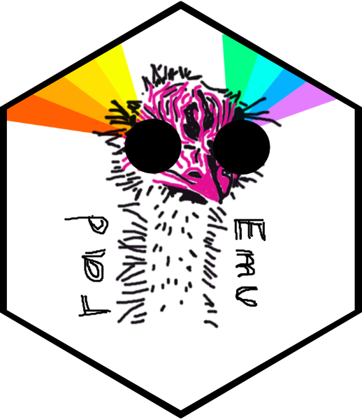

# radEmu 

<!-- badges: start -->
[](https://github.com/statdivlab/radEmu/actions)
[](https://app.codecov.io/github/statdivlab/radEmu)
<!-- badges: end -->

`radEmu` is an `R` package for estimating changes in the abundance of microbial taxa using amplicon or shotgun sequencing technologies. 

<!-- test -->

If you are a **microbial ecologist** or **bioinformatician**, some of the things that you may like about `radEmu` include

- `radEmu` uses your amplicon or shotgun sequencing to estimate changes in the "absolute abundance" of microbial taxa. Here, "absolute abundance" could be interpreted on the cell count, cell concentration or DNA concentration scale. Yes! It's true! 
    - We know this sounds magical! You can check out Section 2 of the manuscript for details. 
    - In brief, we *can't* recover the absolute abundance of taxa in *any individual sample* from amplicon or shotgun sequencing. However, we *can* estimate fold-differences in abundances *across samples*. 
- `radEmu` formalizes some of the nice things about log-ratio-type methods for differential abundance, including
    - `radEmu` is robust to differential detection of taxa, so you don't have to worry about (e.g.) the different extraction/PCR efficiency of your protocol
    - `radEmu` is robust to unequal sampling effort. No need to rarefy! (Actually, please [don't](https://www.frontiersin.org/journals/microbiology/articles/10.3389/fmicb.2019.02407/full).)
    - `radEmu` deals with zeroes natively, without any need for arbitrary parameters like *pseudocounts*
    - `radEmu` does not require that you have a "reference taxon" that is not changing in abundance across samples
        - Instead, `radEmu` estimates differences in abundance across taxa 
- Amongst existing methods, `radEmu` is *most similar in flavor* to ALDEx2 and ANCOM (and ANCOM relatives), but doesn't require priors, log-ratio transformations (and thus pseudocounts), nor a reference taxon! 
- `radEmu` can adjust for relevant covariates, including precision variables and confounders
- `radEmu` achieves all of the above by jointly modeling all taxa (i.e., it's not a taxon-by-taxon model like corncob). This makes it harder to parallelize, but fortunately *testing* can be parallelized easily. (There's is an example in the preprint's [supplementary material](https://github.com/statdivlab/radEmu_supplementary), but let us know if you want a tutorial on *how*!) On a standard desktop, `radEmu` can handle 1000 taxa, 800 samples and 12 covariates. You may want to get a 35-minute coffee break while it runs, though. 
- `radEmu` is publicly available in open-source software... right here!

If you are a **statistician**, some of the things that you may like about `radEmu` include

- A clearly defined and interpretable target estimand
- Fast algorithms for estimation under alternative and null hypotheses
- Type 1 error rate control even under pathological distribution misspecification *and* small sample sizes... at the same time!
    - Check out the [preprint](https://arxiv.org/abs/2402.05231) for details! Our model isn't built to cater to zero-inflated Negative Binominally distributed data, but it still did awesome!
    - Note that the robust score tests have better error rate control than the robust Wald tests (they are a bit slower)

Sadly we do not yet have a ~~logo~~ nice-looking logo. If you would like to design us one, please let Amy know! 

## Installation

To download the radEmu package, use the code below.

``` r
# install.packages("devtools")
devtools::install_github("statdivlab/radEmu")
library(radEmu)
```

We are currently only releasing `radEmu` via GitHub. If you'd like us to consider submitting to CRAN, please let us know by opening an issue.

## Use

The vignettes demonstrate example usage of the main functions. Please [file an issue](https://github.com/statdivlab/radEmu/issues) if you have a request for a tutorial that is not currently included. The following code shows the easy-to-use syntax if your data is in a `phyloseq` object, and you want to estimate parameters for all taxa and run a test for the parameter associated with "Group" and taxon 1: 

``` r
ch_fit <- emuFit(formula = ~ Group + Study + Gender + Sampling, 
                 Y = my_phyloseq_object, 
                 test_kj = data.frame(k = 2, j = 1)) 
```

and if your abundances and covariates are in a dataframe, you can use the following, in which you want to estimate parameters for all taxa and run tests for the parameters associated with "Group" for all taxa: 

```r
all_fit <- emuFit(formula = ~ Group + Study + Gender + Sampling,
                  data = my_covariates_df, 
                  Y = my_abundances_df,
                  test_kj = data.frame(k = 2, j = 1:ncol(my_abundances_df)))
```
## Documentation 

We additionally have a `pkgdown` [website](https://statdivlab.github.io/radEmu/) that contains pre-built versions of our function [documentation](https://statdivlab.github.io/radEmu/reference/index.html) and our vignettes (an introductory [vignette](https://statdivlab.github.io/radEmu/articles/intro_radEmu.html), an introductory [vignette](https://statdivlab.github.io/radEmu/articles/intro_radEmu_with_phyloseq.html) that uses `phyloseq` data, an introductory [vignette](https://statdivlab.github.io/radEmu/articles/intro_radEmu_with_tse.html) that uses `TreeSummarizedExperiment` data, a [vignette](https://statdivlab.github.io/radEmu/articles/radEmu_with_reference_taxon.html) for optionally specifying a reference taxon for an analysis, a [vignette](https://statdivlab.github.io/radEmu/articles/parallel_radEmu.html) for running `radEmu` tests in parallel for more efficient computation, and a [vignette](https://statdivlab.github.io/radEmu/articles/radEmu_clustered_data.html) for running `radEmu` with clustered data). 

## Citation

If you use `radEmu` for your analysis, please cite our open-access preprint, available on arXiv. 

David S Clausen and Amy D Willis. 2024+. "Estimating Fold Changes from Partially Observed Outcomes with Applications in Microbial Metagenomics." [arxiv.org/abs/2402.05231](https://arxiv.org/abs/2402.05231)

Huge thanks to the NIGMS for funding this work through Amy's R35! 

## Bug Reports / Change Requests

If you encounter a bug or would like make a change request, please file it as an issue [here](https://github.com/statdivlab/radEmu/issues).

If you're a developer, we would love to review your pull requests. 

## Nomenclature

When we are not developing fast, robust and interpretable estimation methods, we enjoy making up silly names for our fast, robust and interpretable estimation methods. `radEmu` abbreviates `radEmuAbPill`, which denotes "using **r**elative **a**bundance **d**ata to **e**stimate **mu**ltiplicative differences in **ab**solute abundances with **p**artially **i**dentified **l**og-**l**inear models."