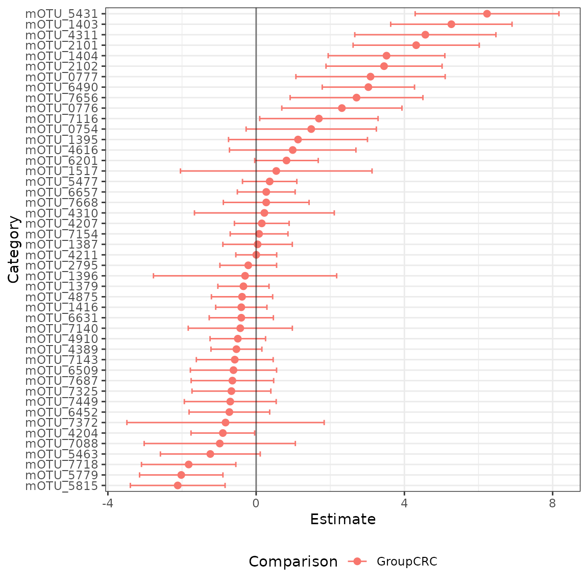

# Introduction to radEmu

First, we will install `radEmu`, if we haven’t already.

``` r
# if (!require("remotes", quietly = TRUE))
#     install.packages("remotes")
# 
# remotes::install_github("statdivlab/radEmu")
```

Next, we can load `radEmu` as well as the `tidyverse` package suite.

``` r
library(magrittr)
library(dplyr)
library(ggplot2)
library(stringr)
library(radEmu)
```

## Introduction

In this lab we’ll explore a [dataset published by Wirbel et
al. (2019)](https://www.nature.com/articles/s41591-019-0406-6). This is
a meta-analysis of case-control studies, meaning that Wirbel et
al. collected raw sequencing data from studies other researchers
conducted and re-analyzed it (in this case, they also collected some new
data of their own).

Wirbel et al. published two pieces of data we’ll focus on today:

- metadata giving demographics and other information about participants
- a mOTU (metagenomic OTU) table

In the manuscript, we looked at differential abundance across otherwise
similar colorectal cancer and non-cancer control study participants for
the 849 mOTUs that Wirbel et al. published. For the purpose of having a
streamlined tutorial, we will only look at a subset of those 849 mOTUs
in this vignette.

## Loading and exploring data

We’ll start by looking at the metadata.

``` r
data("wirbel_sample")
dim(wirbel_sample)
#> [1] 566  14
head(wirbel_sample)
#>                             Sample_ID External_ID Age Gender BMI Country  Study
#> CCIS00146684ST.4.0 CCIS00146684ST-4-0      FR-726  72      F  25     FRA FR-CRC
#> CCIS00281083ST.3.0 CCIS00281083ST-3-0      FR-060  53      M  32     FRA FR-CRC
#> CCIS02124300ST.4.0 CCIS02124300ST-4-0      FR-568  35      M  23     FRA FR-CRC
#> CCIS02379307ST.4.0 CCIS02379307ST-4-0      FR-828  67      M  28     FRA FR-CRC
#> CCIS02856720ST.4.0 CCIS02856720ST-4-0      FR-027  74      M  27     FRA FR-CRC
#> CCIS03473770ST.4.0 CCIS03473770ST-4-0      FR-192  29      M  24     FRA FR-CRC
#>                    Group Library_Size Age_spline.1 Age_spline.2 BMI_spline.1
#> CCIS00146684ST.4.0   CTR     35443944  -0.19755428    0.7389621   1.18982420
#> CCIS00281083ST.3.0   CTR     19307896  -0.08126128   -0.6818534  -1.40679307
#> CCIS02124300ST.4.0   CTR     42141246  -2.17453529   -0.6818534   0.45476676
#> CCIS02379307ST.4.0   CRC      4829533   0.67464323   -0.1490476   0.07698823
#> CCIS02856720ST.4.0   CTR     34294675  -0.54643328    1.0941660   0.44793355
#> CCIS03473770ST.4.0   CTR     20262319  -2.87229329   -0.6818534   0.95261443
#>                    BMI_spline.2 Sampling
#> CCIS00146684ST.4.0   -0.5606919   BEFORE
#> CCIS00281083ST.3.0    2.0039136   BEFORE
#> CCIS02124300ST.4.0   -0.6706035   BEFORE
#> CCIS02379307ST.4.0    0.5384247   BEFORE
#> CCIS02856720ST.4.0    0.1720525   BEFORE
#> CCIS03473770ST.4.0   -0.6706035   BEFORE
```

We can see that this dataset includes $566$ observations and $14$
variables. Let’s see how many observations we have among cases (“CRC”)
and controls (“CTR”)

``` r
wirbel_sample %>%
  group_by(Group) %>%
  summarize(count = n())
#> # A tibble: 2 × 2
#>   Group count
#>   <chr> <int>
#> 1 CRC     278
#> 2 CTR     288
```

We have data from studies in 5 different countries. How much from each
study, you ask? Let’s find out!

``` r
wirbel_sample %>%
  group_by(Country) %>%
  summarize(count = n())
#> # A tibble: 5 × 2
#>   Country count
#>   <chr>   <int>
#> 1 AUS       109
#> 2 CHI       126
#> 3 FRA       110
#> 4 GER       120
#> 5 USA       101
```

Let’s see how many cases and controls were enrolled in each study as
well.

``` r
wirbel_sample %>%
  group_by(Country, Group) %>%
  summarize(n = n())
#> `summarise()` has grouped output by 'Country'. You can override using the
#> `.groups` argument.
#> # A tibble: 10 × 3
#> # Groups:   Country [5]
#>    Country Group     n
#>    <chr>   <chr> <int>
#>  1 AUS     CRC      46
#>  2 AUS     CTR      63
#>  3 CHI     CRC      72
#>  4 CHI     CTR      54
#>  5 FRA     CRC      51
#>  6 FRA     CTR      59
#>  7 GER     CRC      60
#>  8 GER     CTR      60
#>  9 USA     CRC      49
#> 10 USA     CTR      52
```

Now let’s load the mOTU table.

``` r
data("wirbel_otu")
dim(wirbel_otu)
#> [1] 566 845
# let's check out a subset
wirbel_otu[1:5, 1:3]
#>                    Streptococcus anginosus [ref_mOTU_v2_0004]
#> CCIS00146684ST.4.0                                          0
#> CCIS00281083ST.3.0                                          0
#> CCIS02124300ST.4.0                                          2
#> CCIS02379307ST.4.0                                          0
#> CCIS02856720ST.4.0                                          1
#>                    Enterobacteriaceae sp. [ref_mOTU_v2_0036]
#> CCIS00146684ST.4.0                                         3
#> CCIS00281083ST.3.0                                         0
#> CCIS02124300ST.4.0                                         5
#> CCIS02379307ST.4.0                                         5
#> CCIS02856720ST.4.0                                       675
#>                    Citrobacter sp. [ref_mOTU_v2_0076]
#> CCIS00146684ST.4.0                                  0
#> CCIS00281083ST.3.0                                  0
#> CCIS02124300ST.4.0                                  0
#> CCIS02379307ST.4.0                                  0
#> CCIS02856720ST.4.0                                  0
```

We can see that this table has $566$ samples (just like the metadata)
and $845$ mOTUs. Let’s save these mOTU names in a vector.

``` r
mOTU_names <- colnames(wirbel_otu)
```

## Fitting a model

`radEmu` is a package that can be used to estimate fold-differences in
the abundance of microbial taxa between levels of a covariate. In this
analysis, the covariate that we are primarily interested in is whether a
sample is from a case of colorectal cancer or a control. We will make
control (“CTR”) the reference category:

``` r
wirbel_sample$Group <- factor(wirbel_sample$Group, levels = c("CTR","CRC"))
```

While in general we would fit a model to all mOTUs, we are going to
subset to some specific genera for the purposes of this tutorial. Let’s
look at *Eubacterium*, *Porphyromonas*, *Faecalibacteria*, and
*Fusobacterium* for now.

``` r
chosen_genera <- c("Eubacterium", "Faecalibacterium", "Fusobacterium", "Porphyromonas")
mOTU_name_df <- data.frame(name = mOTU_names) %>% 
  mutate(base_name = stringr::str_remove(mOTU_names, "unknown ") %>%
                      stringr::str_remove("uncultured ")) %>%
  mutate(genus_name = stringr::word(base_name, 1))
restricted_mOTU_names <- mOTU_name_df %>%
  filter(genus_name %in% chosen_genera) %>%
  pull(name)
```

Again, while we would generally fit a model using all of our samples,
for this tutorial we are only going to consider data from a case-control
study from China.

``` r
ch_study_obs <- which(wirbel_sample$Country %in% c("CHI"))
```

Next, we want to confirm that all samples have at least one non-zero
count across the categories we’ve chosen and that all categories have at
least one non-zero count across the samples we’ve chosen.

``` r
small_Y <- wirbel_otu[ch_study_obs, restricted_mOTU_names]
sum(rowSums(small_Y) == 0) # no samples have a count sum of 0 
#> [1] 0
sum(colSums(small_Y) == 0) # one category has a count sum of 0
#> [1] 1

category_to_rm <- which(colSums(small_Y) == 0)
small_Y <- small_Y[, -category_to_rm]
sum(colSums(small_Y) == 0)
#> [1] 0
```

The function that we use to fit our model is called `emuFit`. It can
accept your data in various forms, and here we will show how to use it
with data frames as input. Check out the `phyloseq` vignette if you’d
like to know how `radEmu` plays with `phyloseq` objects! One version of
inputs to `emuFit` are

- `formula`: This is a formula telling radEmu what predictors to use in
  its model. We are using Group, which is an indicator for case (CRC) vs
  control (CTR).
- `data`: A dataframe containing information on our predictors. Recall
  that here we’re only looking observations from the Chinese study.
- `Y`: A matrix or dataframe containing our observed abundance data
  (e.g., counts or depth measurements). The rows give the observations
  (samples), and the columns give the categories (taxa/mOTUs). Here we
  are only considering the observations from the Chinese study and the
  *Eubacterium*, *Porphyromonas*, *Faecalibacteria*, and *Fusobacterium*
  genera. Note that `Y` doesn’t have to be integer-valued (counts)!

and some optional arguments include

- `run_score_tests`: A logical value denoting whether or not to run
  score tests. Score tests are awesome in their error rate control
  (including with small sample sizes; though of course larger sample
  sizes always give better power), but require refitting the model, so
  can require some compute time.

``` r
ch_fit <- emuFit(formula = ~ Group, 
                 data = wirbel_sample[ch_study_obs, ],
                 Y = small_Y,
                 run_score_tests = FALSE) 
```

Let’s check out what this object looks like!

``` r
ch_fit
#> 
#> Call:
#> emuFit(Y = small_Y, formula = ~Group, data = wirbel_sample[ch_study_obs, 
#>     ], run_score_tests = FALSE)
#> 
#> 
#> Coefficient estimates with the largest magnitudes:
#>    covariate                                                category
#> 24  GroupCRC               unknown Porphyromonas [meta_mOTU_v2_5431]
#> 8   GroupCRC     Fusobacterium sp. oral taxon 370 [ref_mOTU_v2_1403]
#> 19  GroupCRC                 Fusobacterium varium [ref_mOTU_v2_4311]
#> 12  GroupCRC                Porphyromonas somerae [ref_mOTU_v2_2101]
#> 9   GroupCRC         Fusobacterium gonidiaformans [ref_mOTU_v2_1404]
#> 13  GroupCRC                Porphyromonas uenonis [ref_mOTU_v2_2102]
#> 3   GroupCRC Fusobacterium nucleatum s. nucleatum [ref_mOTU_v2_0777]
#> 31  GroupCRC               unknown Porphyromonas [meta_mOTU_v2_6490]
#> 43  GroupCRC               unknown Porphyromonas [meta_mOTU_v2_7656]
#> 2   GroupCRC  Fusobacterium nucleatum s. animalis [ref_mOTU_v2_0776]
#> 28  GroupCRC            unknown Faecalibacterium [meta_mOTU_v2_5815]
#> 27  GroupCRC            unknown Faecalibacterium [meta_mOTU_v2_5779]
#> 46  GroupCRC            unknown Faecalibacterium [meta_mOTU_v2_7718]
#> 36  GroupCRC                 unknown Eubacterium [meta_mOTU_v2_7116]
#> 1   GroupCRC Fusobacterium nucleatum s. vincentii [ref_mOTU_v2_0754]
#> 25  GroupCRC                 unknown Eubacterium [meta_mOTU_v2_5463]
#> 6   GroupCRC                      Eubacterium sp. [ref_mOTU_v2_1395]
#> 21  GroupCRC                Porphyromonas uenonis [ref_mOTU_v2_4616]
#> 35  GroupCRC             Eubacterium sp. CAG:581 [meta_mOTU_v2_7088]
#> 15  GroupCRC               Eubacterium ventriosum [ref_mOTU_v2_4204]
#>    category_num   estimate        se       lower       upper
#> 24           24  6.2298843 0.9896618  4.29018285  8.16958566
#> 8             8  5.2672095 0.8352276  3.63019353  6.90422538
#> 19           19  4.5652884 0.9714916  2.66119986  6.46937702
#> 12           12  4.3176615 0.8683730  2.61568168  6.01964132
#> 9             9  3.5175422 0.8030461  1.94360069  5.09148371
#> 13           13  3.4508508 0.7990199  1.88480067  5.01690098
#> 3             3  3.0864047 1.0274354  1.07266845  5.10014103
#> 31           31  3.0279940 0.6352314  1.78296337  4.27302458
#> 43           43  2.7082236 0.9140547  0.91670931  4.49973787
#> 2             2  2.3131711 0.8270519  0.69217911  3.93416302
#> 28           28 -2.1162206 0.6522213 -3.39455077 -0.83789044
#> 27           27 -2.0205792 0.5738866 -3.14537617 -0.89578215
#> 46           46 -1.8206825 0.6495167 -3.09371187 -0.54765304
#> 36           36  1.6929929 0.8145063  0.09658995  3.28939586
#> 1             1  1.4863787 0.8965589 -0.27084456  3.24360187
#> 25           25 -1.2363777 0.6871224 -2.58311282  0.11035744
#> 6             6  1.1295236 0.9562677 -0.74472668  3.00377378
#> 21           21  0.9864227 0.8704291 -0.71958691  2.69243233
#> 35           35 -0.9817335 1.0405382 -3.02115095  1.05768395
#> 15           15 -0.8986574 0.4381116 -1.75734022 -0.03997449
#> To obtain the entire coefficient table, use the command `emuFit_object$coef`.
```

Now, we can easily visualize our results using the `plot` function! So
that we only produce the plot, and not the dataframe used to produce the
plots, we will explicitly extract the plots using the `$` operator to
get the `plots` component.

``` r
plot(ch_fit)$plots
#> $p1
```


In the plot above, it is a bit difficult to read the taxa names on the
y-axis. We can create a data frame that maps the full taxa names in our
data to simplified labels and plot using those instead, as shown below.

``` r
#create data frame that has simplified names for taxa
taxa_names <- data.frame("category" = ch_fit$coef$category) %>%
  mutate(cat_small = stringr::str_remove(paste0("mOTU_", 
                            stringr::str_split(category, 'mOTU_v2_', simplify = TRUE)[, 2]), 
                            "\\]"))


#produce plot with cleaner taxa labels
plot(ch_fit, taxon_names = taxa_names)$plots
#> $p1
```



Interestingly, we estimate a meta-mOTU “unknown Eubacterium
\[meta_mOTU_v2_7116\]” assigned to Eubacteria to have a much higher
ratio of abundance (comparing CRC group to control) than is typical
across the mOTUs we included in this analysis.

The confidence interval for this effect does not include zero – but
(!!!) the kind of confidence interval that is returned by default by
emuFit is not extremely reliable when counts are very skewed or sample
size is small-to-moderate.

To investigate further, let’s run a robust score test, which is more
reliable in these settings (but also takes more time because apparently
we can’t have nice things). For comparison, we’ll also test the mOTU
“Fusobacterium nucleatum s. nucleatum \[ref_mOTU_v2_0777\]”, which we
also estimate to have a much larger ratio of concentrations across
groups than is typical among the taxa we included in this model fit.

To set up this test, we can again run `emuFit`, giving it the fitted
values that it’s already found:

- `formula`, `data` and `Y` are as before
- `B` is our previous fitted object (the output of `emuFit`)
- `test_kj` a dataframe listing the indices of the parameters (in
  `ch_fit$B`) that we want to test. Below we show how to identify these,
  but `j = 3` is F. nucleatum and `j = 36` is the *Eubacterium* meta
  mOTU. Note that while `test_kj` was an optional argument in previous
  software versions, in `radEmu` v2.0.0.0 and forward `test_kj` is
  required when `run_score_tests = TRUE`.

``` r
taxa_to_test <- c(which(str_detect(restricted_mOTU_names, "0777")), 
                  which(str_detect(restricted_mOTU_names, "7116")))
design <- make_design_matrix(formula = ~ Group, data = wirbel_sample[ch_study_obs, ])
colnames(design)
#> [1] "(Intercept)" "GroupCRC"
covariate_to_test <- 2 # we see in the previous line that the covariate we care about corresponds to the second column of the design matrix
ch_fit$B %>% rownames
#> [1] "(Intercept)" "GroupCRC"
two_robust_score_tests <- emuFit(formula = ~ Group,
                                 data = wirbel_sample[ch_study_obs, ],
                                 B = ch_fit$B,
                                 test_kj = data.frame(k = covariate_to_test, 
                                                      j = taxa_to_test), 
                                 Y = small_Y)
```

Let’s take a look at the test output.

``` r
two_robust_score_tests$coef[taxa_to_test, c("covariate", "category", "estimate", "pval")]
#>    covariate                                                category estimate
#> 3   GroupCRC Fusobacterium nucleatum s. nucleatum [ref_mOTU_v2_0777] 3.086405
#> 36  GroupCRC                 unknown Eubacterium [meta_mOTU_v2_7116] 1.692993
#>          pval
#> 3  0.07433294
#> 36 0.30172188
```

The *Fusobacterium nucleatum* mOTU has a robust score test p-value of
0.07, while the unknown Eubacterium mOTU has a robust score test p-value
of 0.3. Does this make sense? Let’s investigate further by looking at
the Eubacterium mOTU counts by Group.

``` r
data.frame(counts = wirbel_otu[ch_study_obs, "unknown Eubacterium [meta_mOTU_v2_7116]"],
           group = wirbel_sample$Group[ch_study_obs]) %>%
  mutate(eubact_present = counts > 0) %>%
  group_by(group, eubact_present) %>%
  count()
#> # A tibble: 3 × 3
#> # Groups:   group, eubact_present [3]
#>   group eubact_present     n
#>   <fct> <lgl>          <int>
#> 1 CTR   FALSE             54
#> 2 CRC   FALSE             71
#> 3 CRC   TRUE               1
```

We only detect this meta-mOTU in a single sample in the Chinese study
cohort! So, yes – it makes sense that our test returns a relatively
large p-value. Good job, `emuFit`!

Now let’s look at *F. nucleatum*.

``` r
data.frame(counts = wirbel_otu[ch_study_obs, 
                               "Fusobacterium nucleatum s. nucleatum [ref_mOTU_v2_0777]"],
           group = wirbel_sample$Group[ch_study_obs]) %>%
  mutate(fuso_present = counts > 0) %>%
  group_by(group, fuso_present) %>%
  count()
#> # A tibble: 4 × 3
#> # Groups:   group, fuso_present [4]
#>   group fuso_present     n
#>   <fct> <lgl>        <int>
#> 1 CTR   FALSE           53
#> 2 CTR   TRUE             1
#> 3 CRC   FALSE           59
#> 4 CRC   TRUE            13
```

This also makes sense given what we found – *F. nucleatum* shows up in a
sizeable minority of CRC cases, whereas Wirbel et al detect it in only
one control participant.

We could run robust score tests for every taxon in this analysis, but it
will take a longer amount of time to run. The code below will not run in
the vignette, but feel free to run it on your own.

``` r
test_all <- emuFit(formula = ~ Group, 
                   data = wirbel_sample[ch_study_obs, ],
                   B = ch_fit,
                   Y = small_Y,
                   run_score_tests = TRUE)
```

## A more reasonable model

In the above analysis, we provided a basic illustration of our method
looking at a small number of taxa, in a subset of samples (one study out
of five). However, if we we’re truly interested in identifying taxa that
are unusually abundant in either CRC cases or controls, it would make
sense to compare across study populations that are similar in their sex,
age, BMI, country and whether the samples were provided before
undergoing colonoscopy or after. That’s what we did in our manuscript!
Code to fit this model is below.

``` r
all_fit <- emuFit(formula = ~ Group + Study + Gender +
                    Age_spline.1 + Age_spline.2 + 
                    BMI_spline.1 + BMI_spline.2 + Sampling,
                  data = wirbel_sample, 
                  Y = wirbel_otu[, restricted_mOTU_names],
                  run_score_tests = FALSE)
```

Note that we wanted to allow in non-linear trends in age and BMI, which
we did using B-splines. If you’re interested in doing something similar,
you could adapt the code below.

``` r
age_spline <- splines2::bSpline(wirbel_sample$Age, degree = 1, knots = median(wirbel_sample$Age))
age_spline[,1] <- (age_spline[,1] - mean(age_spline[,1]))/sd(age_spline[,1])
age_spline[,2] <- (age_spline[,2] - mean(age_spline[,2]))/sd(age_spline[,2])

bmi_spline <- splines2::bSpline(wirbel_sample$BMI, degree = 1, knots = median(wirbel_sample$BMI))
bmi_spline[,1] <- (bmi_spline[,1] - mean(bmi_spline[,1]))/sd(bmi_spline[,1])
bmi_spline[,2] <- (bmi_spline[,2] - mean(bmi_spline[,2]))/sd(bmi_spline[,2])
```
