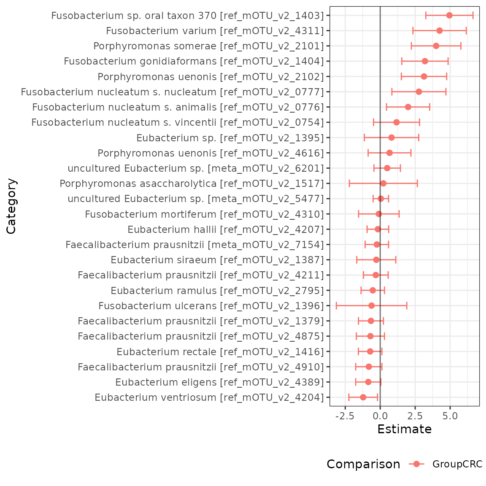

# Introduction to radEmu with phyloseq

First, we will install `radEmu`, if we haven’t already.

``` r
# if (!require("remotes", quietly = TRUE))
#     install.packages("remotes")
#
# remotes::install_github("statdivlab/radEmu")
```

Next, we can load `radEmu` as well as the `tidyverse` package suite.

``` r
library(magrittr)
library(dplyr)
library(ggplot2)
library(stringr)
library(radEmu)
```

## Introduction

This vignette provides an introduction to using `radEmu` for
differential abundance analysis using a `phyloseq` data object. For more
in-depth explanations of how this software works and details on this
analysis, see the vignette “intro_radEmu.Rmd”.

In this lab we’ll explore a [dataset published by Wirbel et
al. (2019)](https://www.nature.com/articles/s41591-019-0406-6). This is
a meta-analysis of case-control studies, meaning that Wirbel et
al. collected raw sequencing data from studies other researchers
conducted and re-analyzed it (in this case, they also collected some new
data of their own).

Wirbel et al. published two pieces of data we’ll focus on today:

- metadata giving demographics and other information about participants
- a mOTU (metagenomic OTU) table

In the manuscript, we looked at differential abundance across otherwise
similar colorectal cancer and non-cancer control study participants for
the 849 mOTUs that Wirbel et al. published. For the purpose of having a
streamlined tutorial, we will only look at a subset of those 849 mOTUs
in this vignette.

## Loading and exploring data

Note that in order to follow along with this tutorial (but not to use
`radEmu`!) you will need to have `phyloseq` installed. We will check if
you have `phyloseq` installed, and if you do not then you can read the
following code but it will not be run.

``` r
phy <- requireNamespace("phyloseq", quietly = TRUE) == TRUE
```

    #> [1] "phyloseq is installed: TRUE"

Now that we have loaded the `phyloseq` package, we will create our
`phyloseq` data object.

``` r
data(wirbel_sample)
data(wirbel_otu)
data(wirbel_taxonomy)
wirbel_phylo <- phyloseq::phyloseq(phyloseq::sample_data(wirbel_sample),
                                   phyloseq::otu_table(wirbel_otu, taxa_are_rows = FALSE),
                                   phyloseq::tax_table(wirbel_taxonomy))
wirbel_phylo
#> phyloseq-class experiment-level object
#> otu_table()   OTU Table:         [ 845 taxa and 566 samples ]
#> sample_data() Sample Data:       [ 566 samples by 14 sample variables ]
#> tax_table()   Taxonomy Table:    [ 845 taxa by 7 taxonomic ranks ]
```

We’ll start by looking at the metadata.

``` r
dim(phyloseq::sample_data(wirbel_phylo))
#> [1] 566  14
head(phyloseq::sample_data(wirbel_phylo))
#>                             Sample_ID External_ID Age Gender BMI Country  Study
#> CCIS00146684ST.4.0 CCIS00146684ST-4-0      FR-726  72      F  25     FRA FR-CRC
#> CCIS00281083ST.3.0 CCIS00281083ST-3-0      FR-060  53      M  32     FRA FR-CRC
#> CCIS02124300ST.4.0 CCIS02124300ST-4-0      FR-568  35      M  23     FRA FR-CRC
#> CCIS02379307ST.4.0 CCIS02379307ST-4-0      FR-828  67      M  28     FRA FR-CRC
#> CCIS02856720ST.4.0 CCIS02856720ST-4-0      FR-027  74      M  27     FRA FR-CRC
#> CCIS03473770ST.4.0 CCIS03473770ST-4-0      FR-192  29      M  24     FRA FR-CRC
#>                    Group Library_Size Age_spline.1 Age_spline.2 BMI_spline.1
#> CCIS00146684ST.4.0   CTR     35443944  -0.19755428    0.7389621   1.18982420
#> CCIS00281083ST.3.0   CTR     19307896  -0.08126128   -0.6818534  -1.40679307
#> CCIS02124300ST.4.0   CTR     42141246  -2.17453529   -0.6818534   0.45476676
#> CCIS02379307ST.4.0   CRC      4829533   0.67464323   -0.1490476   0.07698823
#> CCIS02856720ST.4.0   CTR     34294675  -0.54643328    1.0941660   0.44793355
#> CCIS03473770ST.4.0   CTR     20262319  -2.87229329   -0.6818534   0.95261443
#>                    BMI_spline.2 Sampling
#> CCIS00146684ST.4.0   -0.5606919   BEFORE
#> CCIS00281083ST.3.0    2.0039136   BEFORE
#> CCIS02124300ST.4.0   -0.6706035   BEFORE
#> CCIS02379307ST.4.0    0.5384247   BEFORE
#> CCIS02856720ST.4.0    0.1720525   BEFORE
#> CCIS03473770ST.4.0   -0.6706035   BEFORE
```

We can see that this dataset includes $566$ observations and $14$
variables.

Now let’s load the mOTU table.

``` r
dim(phyloseq::otu_table(wirbel_phylo))
#> [1] 566 845
# let's check out a subset
phyloseq::otu_table(wirbel_phylo)[1:5, 1:3]
#> OTU Table:          [3 taxa and 5 samples]
#>                      taxa are columns
#>                    Streptococcus anginosus [ref_mOTU_v2_0004]
#> CCIS00146684ST.4.0                                          0
#> CCIS00281083ST.3.0                                          0
#> CCIS02124300ST.4.0                                          2
#> CCIS02379307ST.4.0                                          0
#> CCIS02856720ST.4.0                                          1
#>                    Enterobacteriaceae sp. [ref_mOTU_v2_0036]
#> CCIS00146684ST.4.0                                         3
#> CCIS00281083ST.3.0                                         0
#> CCIS02124300ST.4.0                                         5
#> CCIS02379307ST.4.0                                         5
#> CCIS02856720ST.4.0                                       675
#>                    Citrobacter sp. [ref_mOTU_v2_0076]
#> CCIS00146684ST.4.0                                  0
#> CCIS00281083ST.3.0                                  0
#> CCIS02124300ST.4.0                                  0
#> CCIS02379307ST.4.0                                  0
#> CCIS02856720ST.4.0                                  0
```

We can see that this table has $566$ samples (just like the metadata)
and $845$ mOTUs. Let’s save these mOTU names in a vector.

``` r
mOTU_names <- colnames(phyloseq::otu_table(wirbel_phylo))
```

Finally, we can check out the taxonomy table.

``` r
head(phyloseq::tax_table(wirbel_phylo))
#> Taxonomy Table:     [6 taxa by 7 taxonomic ranks]:
#>                                                     domain     phylum          
#> Streptococcus anginosus [ref_mOTU_v2_0004]          "Bacteria" "Bacillota"     
#> Enterobacteriaceae sp. [ref_mOTU_v2_0036]           "Bacteria" "Pseudomonadota"
#> Citrobacter sp. [ref_mOTU_v2_0076]                  "Bacteria" "Pseudomonadota"
#> Klebsiella michiganensis/oxytoca [ref_mOTU_v2_0079] "Bacteria" "Pseudomonadota"
#> Enterococcus faecalis [ref_mOTU_v2_0116]            "Bacteria" "Bacillota"     
#> Lactobacillus salivarius [ref_mOTU_v2_0125]         "Bacteria" "Bacillota"     
#>                                                     class                
#> Streptococcus anginosus [ref_mOTU_v2_0004]          "Bacilli"            
#> Enterobacteriaceae sp. [ref_mOTU_v2_0036]           "Gammaproteobacteria"
#> Citrobacter sp. [ref_mOTU_v2_0076]                  "Gammaproteobacteria"
#> Klebsiella michiganensis/oxytoca [ref_mOTU_v2_0079] "Gammaproteobacteria"
#> Enterococcus faecalis [ref_mOTU_v2_0116]            "Bacilli"            
#> Lactobacillus salivarius [ref_mOTU_v2_0125]         "Bacilli"            
#>                                                     order             
#> Streptococcus anginosus [ref_mOTU_v2_0004]          "Lactobacillales" 
#> Enterobacteriaceae sp. [ref_mOTU_v2_0036]           "Enterobacterales"
#> Citrobacter sp. [ref_mOTU_v2_0076]                  "Enterobacterales"
#> Klebsiella michiganensis/oxytoca [ref_mOTU_v2_0079] "Enterobacterales"
#> Enterococcus faecalis [ref_mOTU_v2_0116]            "Lactobacillales" 
#> Lactobacillus salivarius [ref_mOTU_v2_0125]         "Lactobacillales" 
#>                                                     family              
#> Streptococcus anginosus [ref_mOTU_v2_0004]          "Streptococcaceae"  
#> Enterobacteriaceae sp. [ref_mOTU_v2_0036]           "Enterobacteriaceae"
#> Citrobacter sp. [ref_mOTU_v2_0076]                  "Enterobacteriaceae"
#> Klebsiella michiganensis/oxytoca [ref_mOTU_v2_0079] "Enterobacteriaceae"
#> Enterococcus faecalis [ref_mOTU_v2_0116]            "Enterococcaceae"   
#> Lactobacillus salivarius [ref_mOTU_v2_0125]         "Lactobacillaceae"  
#>                                                     genus               
#> Streptococcus anginosus [ref_mOTU_v2_0004]          "Streptococcus"     
#> Enterobacteriaceae sp. [ref_mOTU_v2_0036]           "Enterobacteriaceae"
#> Citrobacter sp. [ref_mOTU_v2_0076]                  "Citrobacter"       
#> Klebsiella michiganensis/oxytoca [ref_mOTU_v2_0079] "Klebsiella"        
#> Enterococcus faecalis [ref_mOTU_v2_0116]            "Enterococcus"      
#> Lactobacillus salivarius [ref_mOTU_v2_0125]         "Lactobacillus"     
#>                                                     species                       
#> Streptococcus anginosus [ref_mOTU_v2_0004]          "Streptococcus anginosus"     
#> Enterobacteriaceae sp. [ref_mOTU_v2_0036]           "Enterobacteriaceae bacterium"
#> Citrobacter sp. [ref_mOTU_v2_0076]                  "Citrobacter sp."             
#> Klebsiella michiganensis/oxytoca [ref_mOTU_v2_0079] "Klebsiella michiganensis"    
#> Enterococcus faecalis [ref_mOTU_v2_0116]            "Enterococcus faecalis"       
#> Lactobacillus salivarius [ref_mOTU_v2_0125]         "Ligilactobacillus salivarius"
```

## Fitting a model

`radEmu` is a package that can be used to estimate fold-differences in
the abundance of microbial taxa between levels of a covariate. In this
analysis, the covariate that we are primarily interested in is whether a
sample is from a case of colorectal cancer or a control. We will make
control (“CTR”) the reference category:

``` r
phyloseq::sample_data(wirbel_phylo)$Group <- factor(phyloseq::sample_data(wirbel_phylo)$Group, levels = c("CTR","CRC"))
```

While in general we would fit a model to all mOTUs, we are going to
subset to some specific genera for the purposes of this tutorial. Let’s
look at *Eubacterium*, *Porphyromonas*, *Faecalibacteria*, and
*Fusobacterium* for now.

``` r
chosen_genera <- c("Eubacterium", "Faecalibacterium", "Fusobacterium", "Porphyromonas")
wirbel_restrict <- phyloseq::subset_taxa(wirbel_phylo, genus %in% chosen_genera)
```

Again, while we would generally fit a model using all of our samples,
for this tutorial we are only going to consider data from a case-control
study from China.

``` r
wirbel_china <- phyloseq::subset_samples(wirbel_restrict, Country == "CHI")
```

Next, we want to confirm that all samples have at least one non-zero
count across the categories we’ve chosen and that all categories have at
least one non-zero count across the samples we’ve chosen.

``` r
sum(rowSums(phyloseq::otu_table(wirbel_china)) == 0) # no samples have a count sum of 0 
#> [1] 0
sum(colSums(phyloseq::otu_table(wirbel_china)) == 0) # one category has a count sum of 0 
#> [1] 1
category_to_rm <- names(which(colSums(phyloseq::otu_table(wirbel_china)) == 0))
wirbel_china <- phyloseq::subset_taxa(wirbel_china, species != category_to_rm)
sum(colSums(phyloseq::otu_table(wirbel_china)) == 0) # now no categories have a count sum of 0 
#> [1] 0
```

The function that we use to fit our model is called `emuFit`. It can
accept your data in various forms, and here we will show how to use it
with a `phyloseq` object as input.

``` r
ch_fit <- emuFit(formula = ~ Group, 
                 Y = wirbel_china, 
                 run_score_tests = FALSE) 
```

The way to access estimated coefficients and confidence intervals from
the model is with `ch_fit$coef`.

Now, we can easily visualize our results using the `plot.emuFit`
function!

``` r
plot(ch_fit)$plots
#> $p1
```



If you’d like to see more explanations of the `radEmu` software and
additional analyses of this data, check out the vignette
“intro_radEmu.Rmd”.
