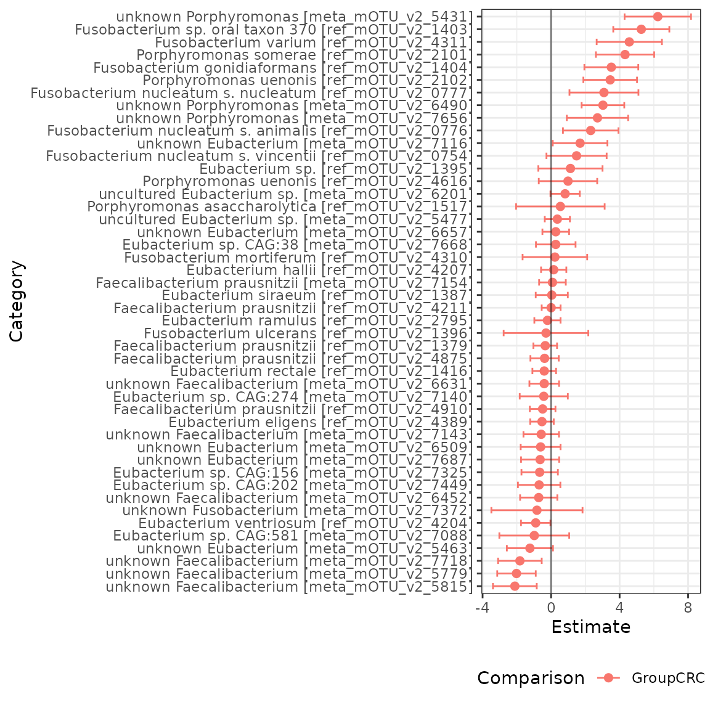

# Introduction to radEmu with TreeSummarizedExperiment

First, we will install `radEmu`, if we haven’t already.

``` r
# if (!require("remotes", quietly = TRUE))
#     install.packages("remotes")
#
# remotes::install_github("statdivlab/radEmu")
```

Next, we can load `radEmu` as well as the `tidyverse` package suite.

``` r
library(magrittr)
library(dplyr)
library(ggplot2)
library(stringr)
library(radEmu)
```

## Introduction

This vignette provides an introduction to using `radEmu` for
differential abundance analysis using a `TreeSummarizedExperiment` data
object. For more in-depth explanations of how this software works and
details on this analysis, see the vignette “intro_radEmu.Rmd”.

In this lab we’ll explore a [dataset published by Wirbel et
al. (2019)](https://www.nature.com/articles/s41591-019-0406-6). This is
a meta-analysis of case-control studies, meaning that Wirbel et
al. collected raw sequencing data from studies other researchers
conducted and re-analyzed it (in this case, they also collected some new
data of their own).

Wirbel et al. published two pieces of data we’ll focus on today:

- metadata giving demographics and other information about participants
- a mOTU (metagenomic OTU) table

In the manuscript, we looked at differential abundance across otherwise
similar colorectal cancer and non-cancer control study participants for
the 849 mOTUs that Wirbel et al. published. For the purpose of having a
streamlined tutorial, we will only look at a subset of those 849 mOTUs
in this vignette.

## Loading and exploring data

Note that in order to follow along with this tutorial (but not to use
`radEmu`!) you will need to have `TreeSummarizedExperiment` installed.
We will check if you have `TreeSummarizedExperiment` installed, and if
you do not then you can read the following code but it will not be run.

``` r
tse <- requireNamespace("TreeSummarizedExperiment", quietly = TRUE) == TRUE
```

    #> [1] "TreeSummarizedExperiment is installed: TRUE"

Now that we have loaded the `TreeSummarizedExperiment` package, we will
create our `TreeSummarizedExperiment` data object.

``` r
library(TreeSummarizedExperiment)
library(SummarizedExperiment)
library(SingleCellExperiment)
setClassUnion("ExpData", c("matrix", "SummarizedExperiment"))
```

``` r
data(wirbel_sample)
data(wirbel_otu)
data(wirbel_taxonomy)
wirbel_tse <- TreeSummarizedExperiment(assays = list(Count = t(wirbel_otu)),
                                       rowData = wirbel_taxonomy,
                                       colData = wirbel_sample)
wirbel_tse
#> class: TreeSummarizedExperiment 
#> dim: 845 566 
#> metadata(0):
#> assays(1): Count
#> rownames(845): Streptococcus anginosus [ref_mOTU_v2_0004]
#>   Enterobacteriaceae sp. [ref_mOTU_v2_0036] ... unknown Clostridiales
#>   [meta_mOTU_v2_7795] unknown Clostridiales [meta_mOTU_v2_7800]
#> rowData names(7): domain phylum ... genus species
#> colnames(566): CCIS00146684ST.4.0 CCIS00281083ST.3.0 ... SAMEA3178940
#>   SAMEA3178943
#> colData names(14): Sample_ID External_ID ... BMI_spline.2 Sampling
#> reducedDimNames(0):
#> mainExpName: NULL
#> altExpNames(0):
#> rowLinks: NULL
#> rowTree: NULL
#> colLinks: NULL
#> colTree: NULL
```

We’ll start by looking at the metadata.

``` r
dim(colData(wirbel_tse))
#> [1] 566  14
head(colData(wirbel_tse))
#> DataFrame with 6 rows and 14 columns
#>                             Sample_ID External_ID       Age      Gender
#>                           <character> <character> <integer> <character>
#> CCIS00146684ST.4.0 CCIS00146684ST-4-0      FR-726        72           F
#> CCIS00281083ST.3.0 CCIS00281083ST-3-0      FR-060        53           M
#> CCIS02124300ST.4.0 CCIS02124300ST-4-0      FR-568        35           M
#> CCIS02379307ST.4.0 CCIS02379307ST-4-0      FR-828        67           M
#> CCIS02856720ST.4.0 CCIS02856720ST-4-0      FR-027        74           M
#> CCIS03473770ST.4.0 CCIS03473770ST-4-0      FR-192        29           M
#>                          BMI     Country       Study       Group Library_Size
#>                    <numeric> <character> <character> <character>    <integer>
#> CCIS00146684ST.4.0        25         FRA      FR-CRC         CTR     35443944
#> CCIS00281083ST.3.0        32         FRA      FR-CRC         CTR     19307896
#> CCIS02124300ST.4.0        23         FRA      FR-CRC         CTR     42141246
#> CCIS02379307ST.4.0        28         FRA      FR-CRC         CRC      4829533
#> CCIS02856720ST.4.0        27         FRA      FR-CRC         CTR     34294675
#> CCIS03473770ST.4.0        24         FRA      FR-CRC         CTR     20262319
#>                    Age_spline.1 Age_spline.2 BMI_spline.1 BMI_spline.2
#>                       <numeric>    <numeric>    <numeric>    <numeric>
#> CCIS00146684ST.4.0   -0.1975543     0.738962    1.1898242    -0.560692
#> CCIS00281083ST.3.0   -0.0812613    -0.681853   -1.4067931     2.003914
#> CCIS02124300ST.4.0   -2.1745353    -0.681853    0.4547668    -0.670604
#> CCIS02379307ST.4.0    0.6746432    -0.149048    0.0769882     0.538425
#> CCIS02856720ST.4.0   -0.5464333     1.094166    0.4479336     0.172053
#> CCIS03473770ST.4.0   -2.8722933    -0.681853    0.9526144    -0.670604
#>                       Sampling
#>                    <character>
#> CCIS00146684ST.4.0      BEFORE
#> CCIS00281083ST.3.0      BEFORE
#> CCIS02124300ST.4.0      BEFORE
#> CCIS02379307ST.4.0      BEFORE
#> CCIS02856720ST.4.0      BEFORE
#> CCIS03473770ST.4.0      BEFORE
```

We can see that this dataset includes $566$ observations and $14$
variables.

Now let’s look at the mOTU table.

``` r
dim(assay(wirbel_tse, "Count"))
#> [1] 845 566
# let's check out a subset
assay(wirbel_tse, "Count")[1:5, 1:3]
#>                                                     CCIS00146684ST.4.0
#> Streptococcus anginosus [ref_mOTU_v2_0004]                           0
#> Enterobacteriaceae sp. [ref_mOTU_v2_0036]                            3
#> Citrobacter sp. [ref_mOTU_v2_0076]                                   0
#> Klebsiella michiganensis/oxytoca [ref_mOTU_v2_0079]                  0
#> Enterococcus faecalis [ref_mOTU_v2_0116]                             0
#>                                                     CCIS00281083ST.3.0
#> Streptococcus anginosus [ref_mOTU_v2_0004]                           0
#> Enterobacteriaceae sp. [ref_mOTU_v2_0036]                            0
#> Citrobacter sp. [ref_mOTU_v2_0076]                                   0
#> Klebsiella michiganensis/oxytoca [ref_mOTU_v2_0079]                  0
#> Enterococcus faecalis [ref_mOTU_v2_0116]                             0
#>                                                     CCIS02124300ST.4.0
#> Streptococcus anginosus [ref_mOTU_v2_0004]                           2
#> Enterobacteriaceae sp. [ref_mOTU_v2_0036]                            5
#> Citrobacter sp. [ref_mOTU_v2_0076]                                   0
#> Klebsiella michiganensis/oxytoca [ref_mOTU_v2_0079]                  0
#> Enterococcus faecalis [ref_mOTU_v2_0116]                             6
```

We can see that this table has $566$ samples (just like the metadata)
and $845$ mOTUs. Let’s save these mOTU names in a vector.

``` r
mOTU_names <- rownames(assay(wirbel_tse, "Count"))
```

Finally, we can check out the taxonomy table.

``` r
head(rowData(wirbel_tse))
#> DataFrame with 6 rows and 7 columns
#>                                                          domain         phylum
#>                                                     <character>    <character>
#> Streptococcus anginosus [ref_mOTU_v2_0004]             Bacteria      Bacillota
#> Enterobacteriaceae sp. [ref_mOTU_v2_0036]              Bacteria Pseudomonadota
#> Citrobacter sp. [ref_mOTU_v2_0076]                     Bacteria Pseudomonadota
#> Klebsiella michiganensis/oxytoca [ref_mOTU_v2_0079]    Bacteria Pseudomonadota
#> Enterococcus faecalis [ref_mOTU_v2_0116]               Bacteria      Bacillota
#> Lactobacillus salivarius [ref_mOTU_v2_0125]            Bacteria      Bacillota
#>                                                                   class
#>                                                             <character>
#> Streptococcus anginosus [ref_mOTU_v2_0004]                      Bacilli
#> Enterobacteriaceae sp. [ref_mOTU_v2_0036]           Gammaproteobacteria
#> Citrobacter sp. [ref_mOTU_v2_0076]                  Gammaproteobacteria
#> Klebsiella michiganensis/oxytoca [ref_mOTU_v2_0079] Gammaproteobacteria
#> Enterococcus faecalis [ref_mOTU_v2_0116]                        Bacilli
#> Lactobacillus salivarius [ref_mOTU_v2_0125]                     Bacilli
#>                                                                order
#>                                                          <character>
#> Streptococcus anginosus [ref_mOTU_v2_0004]           Lactobacillales
#> Enterobacteriaceae sp. [ref_mOTU_v2_0036]           Enterobacterales
#> Citrobacter sp. [ref_mOTU_v2_0076]                  Enterobacterales
#> Klebsiella michiganensis/oxytoca [ref_mOTU_v2_0079] Enterobacterales
#> Enterococcus faecalis [ref_mOTU_v2_0116]             Lactobacillales
#> Lactobacillus salivarius [ref_mOTU_v2_0125]          Lactobacillales
#>                                                                 family
#>                                                            <character>
#> Streptococcus anginosus [ref_mOTU_v2_0004]            Streptococcaceae
#> Enterobacteriaceae sp. [ref_mOTU_v2_0036]           Enterobacteriaceae
#> Citrobacter sp. [ref_mOTU_v2_0076]                  Enterobacteriaceae
#> Klebsiella michiganensis/oxytoca [ref_mOTU_v2_0079] Enterobacteriaceae
#> Enterococcus faecalis [ref_mOTU_v2_0116]               Enterococcaceae
#> Lactobacillus salivarius [ref_mOTU_v2_0125]           Lactobacillaceae
#>                                                                  genus
#>                                                            <character>
#> Streptococcus anginosus [ref_mOTU_v2_0004]               Streptococcus
#> Enterobacteriaceae sp. [ref_mOTU_v2_0036]           Enterobacteriaceae
#> Citrobacter sp. [ref_mOTU_v2_0076]                         Citrobacter
#> Klebsiella michiganensis/oxytoca [ref_mOTU_v2_0079]         Klebsiella
#> Enterococcus faecalis [ref_mOTU_v2_0116]                  Enterococcus
#> Lactobacillus salivarius [ref_mOTU_v2_0125]              Lactobacillus
#>                                                                    species
#>                                                                <character>
#> Streptococcus anginosus [ref_mOTU_v2_0004]          Streptococcus angino..
#> Enterobacteriaceae sp. [ref_mOTU_v2_0036]           Enterobacteriaceae b..
#> Citrobacter sp. [ref_mOTU_v2_0076]                         Citrobacter sp.
#> Klebsiella michiganensis/oxytoca [ref_mOTU_v2_0079] Klebsiella michigane..
#> Enterococcus faecalis [ref_mOTU_v2_0116]             Enterococcus faecalis
#> Lactobacillus salivarius [ref_mOTU_v2_0125]         Ligilactobacillus sa..
```

## Fitting a model

`radEmu` is a package that can be used to estimate fold-differences in
the abundance of microbial taxa between levels of a covariate. In this
analysis, the covariate that we are primarily interested in is whether a
sample is from a case of colorectal cancer or a control. We will make
control (“CTR”) the reference category:

``` r
colData(wirbel_tse)$Group <- factor(colData(wirbel_tse)$Group, levels = c("CTR","CRC"))
```

While in general we would fit a model to all mOTUs, we are going to
subset to some specific genera for the purposes of this tutorial. Let’s
look at *Eubacterium*, *Porphyromonas*, *Faecalibacteria*, and
*Fusobacterium* for now.

``` r
chosen_genera <- c("Eubacterium", "Faecalibacterium", "Fusobacterium", "Porphyromonas")
genera_rows <- rowData(wirbel_tse)$genus %in% chosen_genera
wirbel_restrict <- wirbel_tse[genera_rows]
```

Again, while we would generally fit a model using all of our samples,
for this tutorial we are only going to consider data from a case-control
study from China.

``` r
sample_cols <- colData(wirbel_restrict)$Country == "CHI"
wirbel_china <- wirbel_restrict[, sample_cols]
```

Next, we want to confirm that all samples have at least one non-zero
count across the categories we’ve chosen and that all categories have at
least one non-zero count across the samples we’ve chosen.

``` r
sum(colSums(assay(wirbel_china, "Count")) == 0) # no samples have a count sum of 0 
#> [1] 0
sum(rowSums(assay(wirbel_china, "Count")) == 0) # one category has a count sum of 0 
#> [1] 1
category_to_rm <- rowSums(assay(wirbel_china, "Count")) == 0
wirbel_china <- wirbel_china[!category_to_rm, ]
sum(rowSums(assay(wirbel_china, "Count")) == 0) # now no categories have a count sum of 0 
#> [1] 0
```

The function that we use to fit our model is called `emuFit`. It can
accept your data in various forms, and here we will show how to use it
with a `TreeSummarizedExperiment` object as input.

``` r
ch_fit <- emuFit(formula = ~ Group, 
                 Y = wirbel_china, 
                 assay_name = "Count",
                 run_score_tests = FALSE) 
```

The way to access estimated coefficients and confidence intervals from
the model is with `ch_fit$coef`.

Now, we can easily visualize our results using the `plot.emuFit`
function!

``` r
plot(ch_fit)$plots
#> $p1
```



If you’d like to see more explanations of the `radEmu` software and
additional analyses of this data, check out the vignette
“intro_radEmu.Rmd”.
